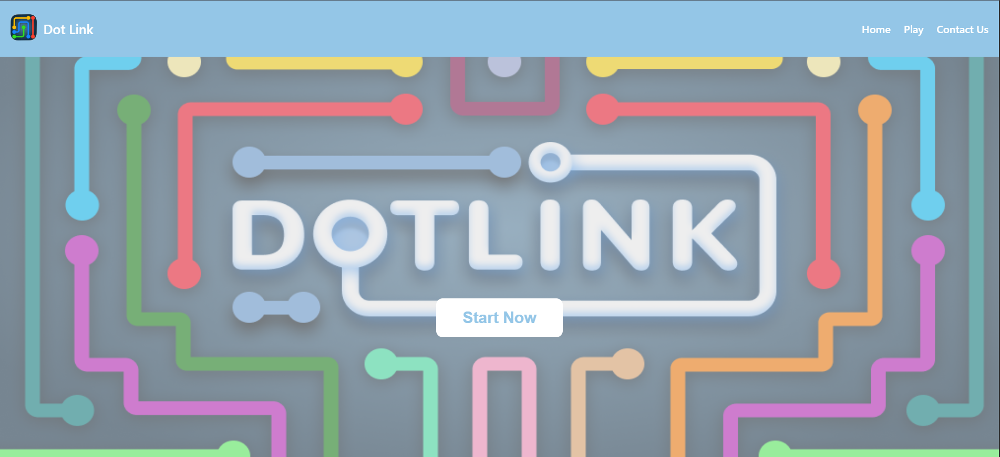
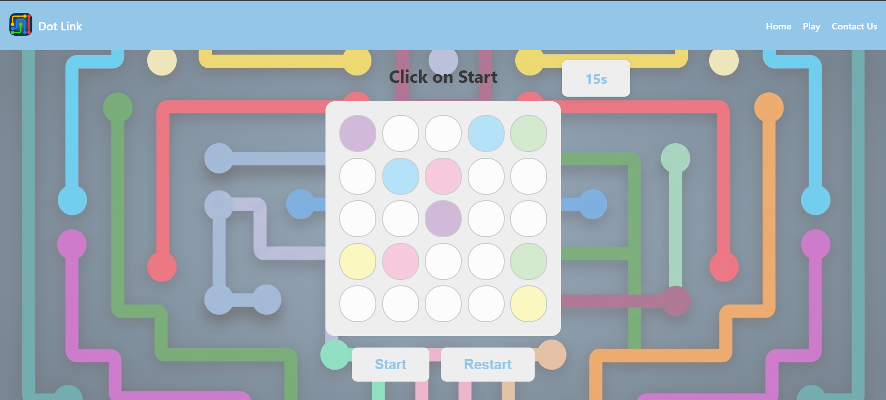
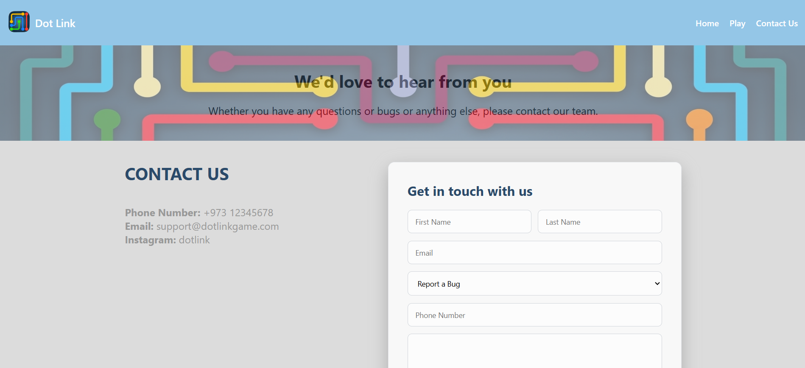

# dotlink

## Project Name
Dot Link

## Technologies Used
1. Html
2. CSS
3. Javascript

## Description
select a colored dot and connect it to the other dot with the same color, without any colors overlapping.

## User stories
1. As a player, I want to connect matching colored dots by drawing a path between them.
2. As a player, I want to see the color of the path while i am playing.
3. As a player, I want to complete all the matching connections to win the game.
4. As a player, I want to know when I completed the game.
5. As a player, I want to see the timer so I know how much time I have left before I lose the game.
6. As a player, I want to reset my progress if I accidentally choose a wrong path.
7. As a player, I want to know if I have chosen the right path.   
8. As a player, I want easy access to the game by clicking on the game icon.
9. As a player, I want to add a compliant if i faced any issues with the game.
10. As a player, I want to be able to restart the game if I want to play again.

## Screenshots
1. 
2. 
3. 

## Future Enhancements
1. add more levels
2. store the compliants from the users

## Credits 
1. used the confetti from this website https://confettipage.com/